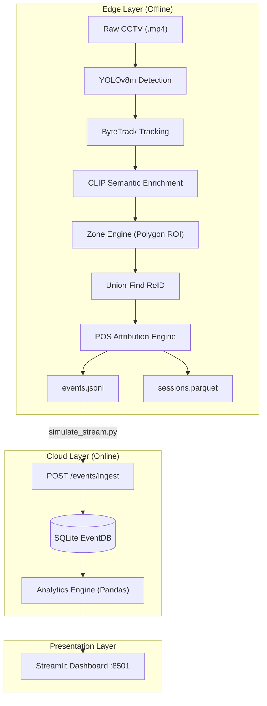
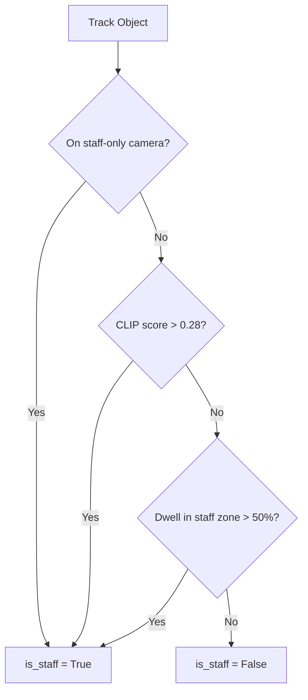

# Purplle Store Intelligence — Multi-Tenant CCTV Analytics Platform  
  
An end-to-end retail analytics system that transforms raw CCTV video feeds into  
actionable business intelligence. The platform tracks anonymous shopper journeys,  
attributes purchases to specific visitor sessions, and surfaces real-time  
operational insights through a decoupled edge-to-cloud architecture.  
  
---  
  
## Table of Contents  
  
- [Overview](#overview)  
- [Architecture](#architecture)  
- [Repository Structure](#repository-structure)  
- [ML Pipeline (Edge Detection Layer)](#ml-pipeline-edge-detection-layer)  
- [Intelligence API (Backend)](#intelligence-api-backend)  
- [Frontend Dashboard](#frontend-dashboard)  
- [Shared Configuration & Data Contracts](#shared-configuration--data-contracts)  
- [Getting Started](#getting-started)  
- [Stream Simulation](#stream-simulation)  
- [API Reference](#api-reference)  
- [Configuration Reference](#configuration-reference)   
- [Glossary](#glossary)  
  
---  
  
## Overview  
  
The Purplle Store Intelligence platform bridges the gap between computer vision  
detections and transactional Point-of-Sale (POS) data. It enables store managers  
to visualize the full conversion funnel — from store entry, through zone  
engagement and billing queue participation, to final transaction — without  
requiring manual data entry or intrusive tracking hardware.  
  
**Supported Stores:**  
- `ST1008` — Store 1 (rectangular floor plan)  
- `ST1076` — Store 2 (L-shaped floor plan, dual entry cameras)  
  
**Key Capabilities:**  
  
| Capability | Description |  
|---|---|  
| Zero-Shot Staff Exclusion | Hybrid CLIP + spatial dwell engine filters employees from shopper metrics |  
| Cross-Camera ReID | Store-Scoped Union-Find graph merges visitor identities across camera views |  
| Temporal POS Attribution | 300-second rolling window links anonymous receipts to tracked sessions |  
| Group Resolution | Temporal clustering prevents footfall inflation for families/couples |  
| Idempotent Ingestion | Database-level `IntegrityError` handling prevents double-counting on retries |  
| Anomaly Detection | Stateless rolling-window queries detect queue spikes and dead zones |  
  
---  
  
## Architecture  
  
The system is divided into three strictly decoupled layers so that heavy GPU  
inference does not block lightweight API responses or dashboard rendering.  
  

  
| Layer | Component | Key Technologies |  
|---|---|---|  
| **Edge / Detection** | ML Pipeline Notebook | YOLOv8m, ByteTrack, CLIP, supervision |  
| **Cloud / Backend** | Intelligence API | FastAPI, SQLAlchemy 2.0, Pydantic v2, Uvicorn |  
| **Presentation** | Operations Dashboard | Streamlit, Plotly |  
  
---  
  
## Repository Structure  
  
```  
purplle-tech-challenge/  
├── pipeline/  
│   └── cctv-hackathon.ipynb      # Full ML pipeline (detection → POS attribution)  
├── backend/  
│   ├── Dockerfile  
│   ├── requirements.txt  
│   └── app/  
│       ├── main.py               # FastAPI app, middleware, all routes  
│       ├── database.py           # SQLAlchemy EventDB model + get_db dependency  
│       ├── schemas.py            # Pydantic EventSchema for request validation  
│       ├── analytics.py          # Pandas-based metrics, funnel, heatmap, anomalies  
│       └── tests/                # pytest suite (idempotency, staff exclusion)  
├── frontend/  
│   ├── Dockerfile  
│   ├── requirements.txt  
│   └── app.py                    # Streamlit dashboard  
├── data_storage/  
│   ├── artifacts/  
│   │   └── events.jsonl          # Pipeline output consumed by simulate_stream.py  
│   └── shared/  
│       ├── schema.py             # EVENTS_SCHEMA, SESSIONS_SCHEMA, EVENT_TYPES  
│       ├── thresholds.py         # All numeric CV and temporal constants  
│       └── prompts.py            # BASE_PROMPTS bank for CLIP classification  
├── simulate_stream.py            # Replays events.jsonl to the live API  
├── docker-compose.yml  
├── requirements.txt  
├── DESIGN.md                     # Architecture rationale  
└── CHOICES.md                    # 10 documented implementation decisions  
```  
  
---  
  
## ML Pipeline (Edge Detection Layer)  
  
The pipeline is implemented as a single Jupyter Notebook:  
`pipeline/cctv-hackathon.ipynb`. It runs offline (GPU recommended) and produces  
the `events.jsonl` and `sessions.parquet` artifacts consumed by the backend.  
  
### Stage 1 — Detection & Tracking  
  
- **YOLOv8m** detects persons in each frame (class index `0` only).  
- **ByteTrack** links detections across frames into persistent `track_id`  
  sequences, resilient to partial occlusions.  
- A `FRAME_STRIDE` of 5 skips redundant frames to optimize throughput without  
  losing track continuity.  
  
### Stage 2 — Semantic Enrichment & Staff Exclusion  
  
A **Hybrid Staff Exclusion Engine** flags a track as `is_staff = True` if *any*  
of three conditions are met:  
  

  
CLIP (`openai/clip-vit-base-patch32`) compares cropped track images against the  
`BASE_PROMPTS` bank in `data_storage/shared/prompts.py` using zero-shot cosine  
similarity — no labeled training data required.  
  
### Stage 3 — Zone Engine, ReID & Sessionization  
  
- **Zone Engine**: `sv.PolygonZone` maps each track's centroid to a named retail  
  zone (`SKINCARE`, `FRAGRANCE`, `BILLING`, etc.) using per-store polygon  
  coordinates from `STORE_CONFIGS`.  
- **Store-Scoped Union-Find ReID**: Merges fragmented tracks from different  
  cameras into a single `visitor_id`. Merging requires cosine similarity ≥ 0.82  
  *and* cross-camera appearance within a 45-second window, scoped strictly per  
  `store_id` to prevent cross-store false positives.  
- **Group Entry Clustering**: Visitors triggering the `ENTRY` threshold within  
  3.0 seconds of each other share a `group_id`, preventing footfall inflation  
  for families and couples.  
  
### Stage 4 — POS Conversion Attribution  
  
Any shopper session with a `BILLING_QUEUE_JOIN` event within 300 seconds before  
a POS transaction timestamp is attributed as `converted`, with the  
`basket_value_inr` linked to that session. This rolling window accounts for the  
real-world delay between a customer leaving the camera's billing zone and the  
cashier finalizing the transaction.  
  
### Output Artifacts  
  
| File | Schema | Description |  
|---|---|---|  
| `data_storage/artifacts/events.jsonl` | `EVENTS_SCHEMA` | Sparse state-change event log |  
| `data_storage/artifacts/sessions.parquet` | `SESSIONS_SCHEMA` | Aggregated visitor journey records |  
| `data_storage/artifacts/camera_role_summary.json` | — | Camera role and exclusion config per store |  
  
---  
  
## Intelligence API (Backend)  
  
A FastAPI service containerized with a `python:3.10-slim` base image, served via  
Uvicorn on port `8000`.  
  
### Middleware  
  
Every request passes through `production_middleware` in `backend/app/main.py`,  
which:  
1. Generates a unique `trace_id` (`uuid.uuid4()`) for distributed tracing.  
2. Catches `sqlalchemy.exc.OperationalError` → returns `503 Service Unavailable`.  
3. Logs a structured JSON payload: `trace_id`, `endpoint`, `method`,  
   `latency_ms`, `status_code`.  
  
### Ingestion Endpoint  
  
**`POST /events/ingest`**  
  
- Accepts a JSON array of `EventSchema` objects (max 500 per request).  
- Iterates the batch and commits each event individually.  
- On `IntegrityError` (duplicate `event_id`), performs `db.rollback()` and  
  skips — guaranteeing strict idempotency.  
- Returns `{ "ingested_count": N, "skipped_duplicates": M }`.  
  
### Analytics Endpoints  
  
| Endpoint | Description |  
|---|---|  
| `GET /stores/{id}/metrics` | KPIs: conversion rate, dwell time, staff % |  
| `GET /stores/{id}/funnel` | Stage-wise counts: Entry → Browse → Billing → Purchase |  
| `GET /stores/{id}/heatmap` | Spatial dwell time per zone |  
| `GET /stores/{id}/anomalies` | Queue spikes (15-min window) and dead zones (30-min window) |  
| `GET /health` | DB connectivity check |  
  
### Data Model (`EventDB`)  
  
Key fields persisted to `purplle.db` (SQLite):  
  
| Field | Type | Description |  
|---|---|---|  
| `event_id` | `String` (PK) | Unique UUID — enforces idempotency |  
| `store_id` | `String` | Physical store identifier |  
| `visitor_id` | `String` | Cross-camera ReID identity |  
| `session_id` | `String` | Single visit instance |  
| `event_type` | `String` | One of `EVENT_TYPES` |  
| `zone_id` | `String` | Named polygon zone |  
| `timestamp` | `Float` | Unix timestamp |  
| `dwell_ms` | `Integer` | Zone dwell duration in milliseconds |  
| `is_staff` | `Boolean` | Staff exclusion flag |  
| `queue_depth` | `Integer` | Billing queue depth at event time |  
| `model_meta` | `JSON` | Arbitrary model metadata (e.g., `group_id`) |  
  
---  
  
## Frontend Dashboard  
  
A Streamlit application containerized on port `8501`. It uses `@st.fragment` to  
refresh the main visualization area every 2 seconds without reloading the full  
page or resetting sidebar state.  
  
### UI Components  
  
| Component | Data Source | Description |  
|---|---|---|  
| System Status Ribbon | `GET /health` | Pipeline health and ingestion latency |  
| Anomaly Banners | `GET /stores/{id}/anomalies` | Critical/Warning alerts for queue spikes or stale feeds |  
| KPI Metrics Row | `GET /stores/{id}/metrics` | Unique Visitors, Conversion Rate, Abandonment Rate |  
| Conversion Funnel | `GET /stores/{id}/funnel` | Plotly funnel: Entry → Browse → Billing → Purchase |  
| Spatial Engagement | `GET /stores/{id}/heatmap` | Plotly bar chart: traffic intensity and avg dwell per zone |  
  
The dashboard communicates with the API over the internal Docker network using  
the `API_URL` environment variable.  
  
---  
  
## Shared Configuration & Data Contracts  
  
`data_storage/shared/` is the single source of truth for the entire platform,  
preventing schema drift between the pipeline and the API.  
  
### `schema.py` — Data Contracts  
  
- **`EVENTS_SCHEMA`**: Column definitions for `events.jsonl` and the  
  `/events/ingest` payload.  
- **`SESSIONS_SCHEMA`**: Aggregated visitor journey fields including  
  `dwell_by_zone`, `zones_visited`, and `conversion_outcome`.  
- **`TRACK_SEMANTICS_SCHEMA`**: Intermediate CLIP output: `micro_intent`,  
  `clip_score`, `staff_score`, `embedding`.  
- **`EVENT_TYPES`**: Canonical allowed values for `event_type`:  
  `ENTRY`, `EXIT`, `REENTRY`, `ZONE_ENTER`, `ZONE_EXIT`, `ZONE_DWELL`,  
  `BILLING_QUEUE_JOIN`, `BILLING_QUEUE_ABANDON`.  
  
### `thresholds.py` — Tunable Constants  
  
**Detection & Tracking**  
  
| Constant | Value | Description |  
|---|---|---|  
| `FRAME_STRIDE` | 5 | Process every 5th frame |  
| `YOLO_CONF` | 0.35 | Detection confidence threshold |  
| `YOLO_IOU` | 0.45 | NMS IoU threshold |  
| `BYTETRACK_MATCH_THRESH` | 0.8 | Hungarian algorithm matching threshold |  
| `BYTETRACK_TRACK_BUFFER` | 120 | Frames to keep a lost track before deletion |  
| `MIN_TRACK_AGE_FRAMES` | 3 | Minimum track age to be considered valid |  
  
**Semantic & Staff Logic**  
  
| Constant | Value | Description |  
|---|---|---|  
| `CLIP_STAFF_THRESHOLD` | 0.28 | CLIP cosine similarity to flag as staff |  
| `CLIP_SPATIAL_STAFF_RATIO` | 0.50 | Fraction of frames in staff zone to flag as staff |  
  
**Temporal & ReID Windows**  
  
| Constant | Value | Description |  
|---|---|---|  
| `GROUP_ENTRY_WINDOW_S` | 3.0 s | Max gap between entries to form a group |  
| `REENTRY_WINDOW_SECONDS` | 300 s | Window to merge a returning shopper into an existing session |  
| `POS_CONVERSION_WINDOW_SEC` | 300 s | Rolling window for POS-to-session attribution |  
| `CROSS_CAM_MATCH_WINDOW` | 45 s | Max time offset for cross-camera identity merging |  
| `REID_SIMILARITY_THRESHOLD` | 0.82 | Cosine similarity required to merge tracks via Union-Find |  
  
### `prompts.py` — CLIP Semantic Prompts  
  
`BASE_PROMPTS` maps visual track crops to retail behaviors via zero-shot  
classification:  
  
| Category | Purpose |  
|---|---|  
| `entry_exit` | Footfall counting |  
| `browse_intent` | Product engagement detection |  
| `billing_queue` | Conversion funnel participation |  
| `billing_abandonment` | Queue abandonment detection |  
| `staff_exclusion` | Employee filtering |  
  
---  
  
## Getting Started  
  
### Prerequisites  
  
- Docker and Docker Compose  
- Python 3.9+ (for the stream simulator)  
- NVIDIA GPU with CUDA (recommended for the ML pipeline notebook)  
  
### 1. Prepare the data directory  
  
The `data_storage/` directory must exist on the host before launching Docker,  
as it is bind-mounted into both containers:  
  
```bash  
mkdir -p data_storage/artifacts  
```  
  
### 2. Run the ML Pipeline (one-time, offline)  
  
Open and execute `pipeline/cctv-hackathon.ipynb` in a Jupyter environment  
(Kaggle or local with GPU). The notebook auto-detects the environment and  
resolves paths. On completion it writes:  
  
```  
data_storage/artifacts/events.jsonl  
data_storage/artifacts/sessions.parquet  
data_storage/artifacts/camera_role_summary.json  
```  
  
### 3. Launch the Docker stack  
  
```bash  
docker-compose up --build  
```  
  
The `frontend` service has a `depends_on: condition: service_healthy` on the  
`api` service. The API health check pings `GET /health` every 10 seconds  
(5 retries, 5-second timeout) before the dashboard starts.  
  
### 4. Verify services  
  
| Service | URL |  
|---|---|  
| API Health | http://localhost:8000/health |  
| API Docs (Swagger) | http://localhost:8000/docs |  
| Dashboard | http://localhost:8501 |  
  
### Environment Variables  
  
| Variable | Default | Description |  
|---|---|---|  
| `DATABASE_URL` | `sqlite:////app/data_storage/purplle.db` | SQLAlchemy connection string |  
| `DATA_DIR` | `/app/data_storage` | Root for persistent artifacts |  
| `JSONL_PATH` | `data_storage/artifacts/events.jsonl` | Input for stream simulator |  
  
---  
  
## Stream Simulation  
  
Because the ML pipeline runs offline, `simulate_stream.py` replays the  
`events.jsonl` artifact to the live API to drive real-time dashboard updates.  
  
```bash  
# With the Docker stack running:  [header-1](#header-1)
python simulate_stream.py  
```  
  
The script:  
1. Loads all events from `data_storage/artifacts/events.jsonl`.  
2. Sorts them chronologically by `timestamp`.  
3. POSTs batches of 50 events to `http://localhost:8000/events/ingest`.  
4. Waits 2 seconds between batches so the Streamlit `@st.fragment` components  
   can trigger visible UI updates.  
  
---  
  
## API Reference  
  
### `POST /events/ingest`  
  
Request body — JSON array of event objects (max 500):  
  
```json  
[  
  {  
    "event_id": "uuid-string",  
    "store_id": "ST1008",  
    "visitor_id": "visitor-uuid",  
    "session_id": "session-uuid",  
    "event_type": "ZONE_ENTER",  
    "camera_id": "CAM1",  
    "zone_id": "MAKEUP",  
    "timestamp": 1700000000.0,  
    "dwell_ms": 0,  
    "confidence": 0.91,  
    "is_staff": false,  
    "queue_depth": 0,  
    "sku_zone": null,  
    "session_seq": 3,  
    "model_meta": {"group_id": null}  
  }  
]  
```  
  
Response:  
  
```json  
{ "status": "success", "ingested_count": 50, "skipped_duplicates": 0 }  
```  
  
### `GET /stores/{store_id}/metrics`  
  
Returns high-level KPIs: unique visitors, conversion rate, abandonment rate,  
average dwell time, staff percentage.  
  
### `GET /stores/{store_id}/funnel`  
  
Returns stage-wise visitor counts for the conversion funnel visualization.  
  
### `GET /stores/{store_id}/heatmap`  
  
Returns per-zone traffic intensity and average dwell time for the spatial  
engagement chart.  
  
### `GET /stores/{store_id}/anomalies`  
  
Returns active anomalies:  
  
- **Queue Spike**: Billing joins in the trailing 15-minute window exceed threshold.  
- **Dead Zone**: No zone entries in the trailing 30-minute window for a given zone.  
- **Stale Feed**: No events received recently from a camera.  
  
### `GET /health`  
  
Returns database connectivity status and basic system health.  
  
---  
  
## Configuration Reference  
  
### `docker-compose.yml` Services  
  
| Service | Container | Port | Build Context |  
|---|---|---|---|  
| `api` | `purplle_api` | `8000` | `./backend` |  
| `frontend` | `purplle_dashboard` | `8501` | `./frontend` |  
  
Volume mount: `./data_storage` → `/app/data_storage` (both services share the  
same artifact directory).  
  
### `requirements.txt` (top-level)  
  
```  
fastapi==0.104.1  
uvicorn==0.24.0  
sqlalchemy==2.0.23  
pydantic==2.5.2  
httpx==0.25.2  
pandas==2.1.3  
pyarrow==14.0.1  
streamlit==1.28.2  
plotly==5.18.0  
requests==2.31.0  
pytest==7.4.3  
```  
  

  
## Glossary  
  
| Term | Definition |  
|---|---|  
| **Track** | A persistent bounding-box sequence for one person within a single camera's field of view |  
| **Visitor ID** | Cross-camera identity, potentially merged from multiple tracks via ReID |  
| **Session ID** | A single visit instance; one `visitor_id` may have multiple sessions after re-entry |  
| **Zone** | A semantically named polygon within the store (e.g., `MAKEUP`, `BILLING`) |  
| **Event** | A sparse state-change notification emitted when a track crosses a zone boundary or enters/exits the store |  
| **Conversion Rate** | Percentage of unique visitors who completed a purchase |  
| **Abandonment Rate** | Percentage of shoppers who joined the billing queue but left before purchasing |  
| **Dwell Time** | `max(timestamp) - min(timestamp)` for a session within a zone, computed in the API layer |  
| **ReID** | Re-Identification — matching a person's identity across different camera views |  
| **Union-Find** | Graph data structure used to merge fragmented track identities into a single `visitor_id` |  
| **Idempotency** | Guarantee that submitting the same `event_id` multiple times produces no duplicate records |  
| **CLIP** | Contrastive Language-Image Pre-training — zero-shot VLM used for staff/shopper classification |  
| **ByteTrack** | Multi-object tracking algorithm chosen for occlusion resilience in retail environments |  
| **STORE_CONFIGS** | Centralized dictionary mapping physical polygon coordinates to semantic zones per store |
